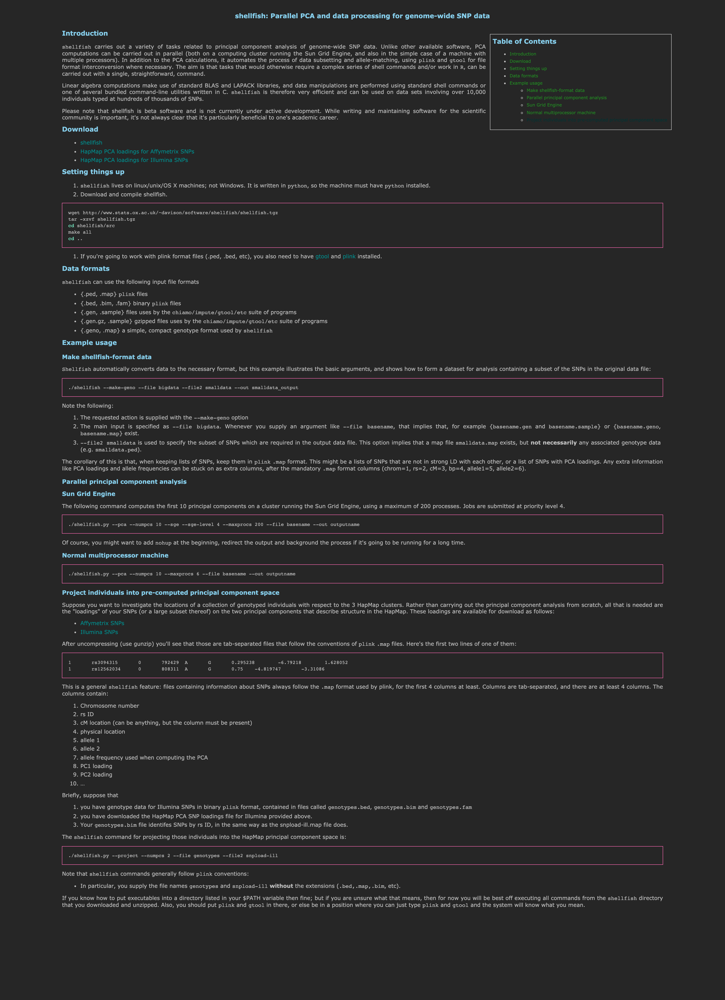

**Please note that this software is not maintained. Do feel free to create issues on github, but I cannot promise to attend to them.**

To compile shellfish you will need a C compiler, and gfortran, BLAS and LAPACK libraries installed. Since this can cause problems, a Dockerfile is included. You can look at the steps in the Dockerfile to see how to install shellfish on Ubuntu linux.

To avoid all compilation problems, you can run the docker container on your own machine, whatever your operating system is. Here is a quick outline of how you might do that:

1. Install docker (https://docs.docker.com/get-docker/)
2. Clone this git repo
3. Put the data files you need into a directory (I assume below that directory is named `/tmp/mydata`)
4. Then:
    ```bash
    cd shellfish
    docker build -t shellfish .
    docker run -v /tmp/mydata:/tmp/mydata -it shellfish bash
    # you are now inside a docker container, but it has your /tmp/mydata
    python shellfish.py --help
    ```


<a href="http://dandavison.github.io/shellfish/"></a>
